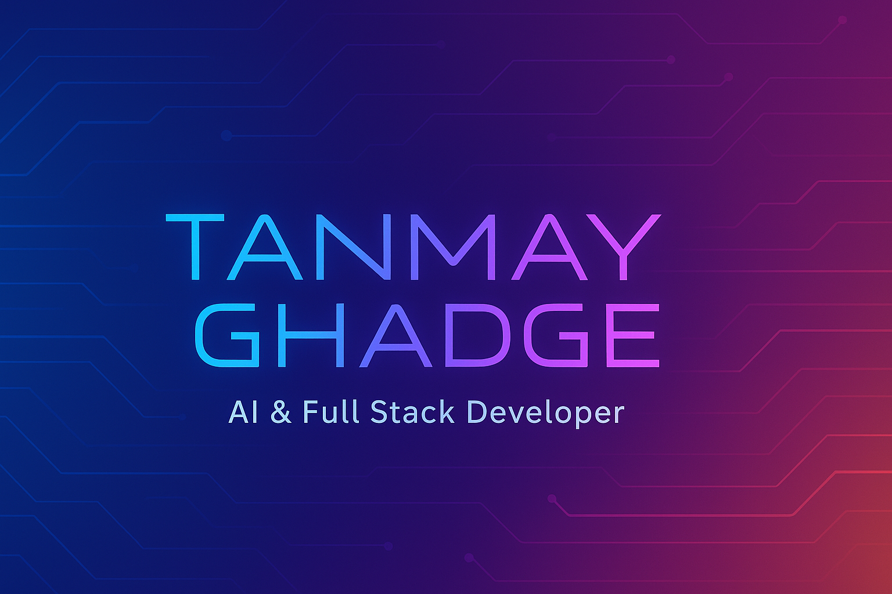

  

<!-- 👋 Animated Intro -->
<h1 align="center">
  
</h1>

<!-- 🌈 Gradient Divider -->

  

<!-- 🧑‍💻 Profile Image -->

  

<!-- gradient -->

  

<h1 align="center">
   💫 About Me
</h1>
<!-- ##  About Me -->

Hi, I'm <b>Tanmay Ghadge</b> — a passionate developer from India 🇮🇳 
I'm focused on building AI-powered web apps & learning advanced backend systems. 
🔥 I love solving problems, automating workflows, and experimenting with new tech stacks.

## ⚙️ Tech Stack 
 

  

---

## 📊 GitHub Analytics

  
  

  

---

## 🌐 Connect With Me

  
  &nbsp;
  
  &nbsp;
  

---

## 🧠 Currently Learning
- FastAPI & MongoDB 🧩  
- Building AI agents 🤖  
- Full Stack Development 🚀

---

## 💡 Fun Fact
> "Code is like humor. When you have to explain it, it's bad." — Cory House